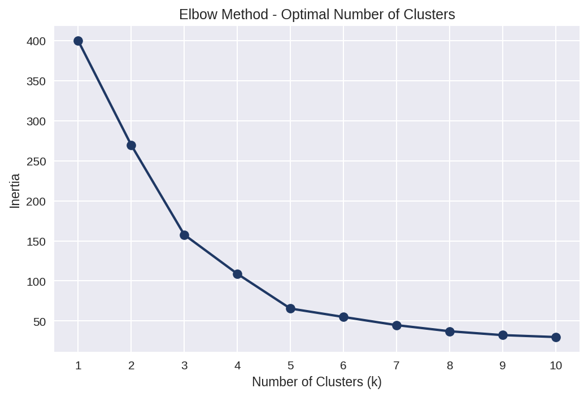
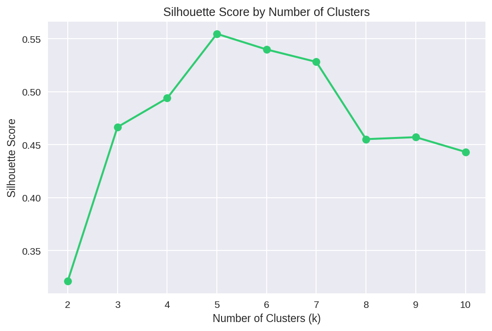
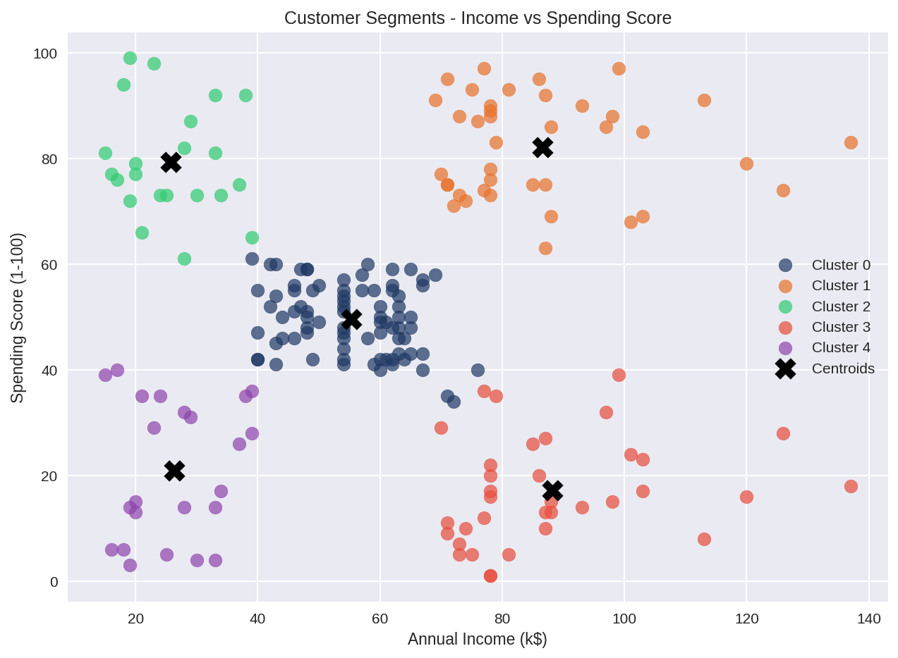
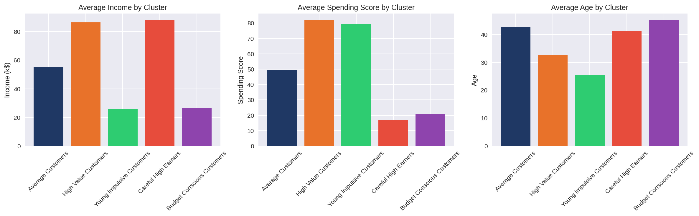
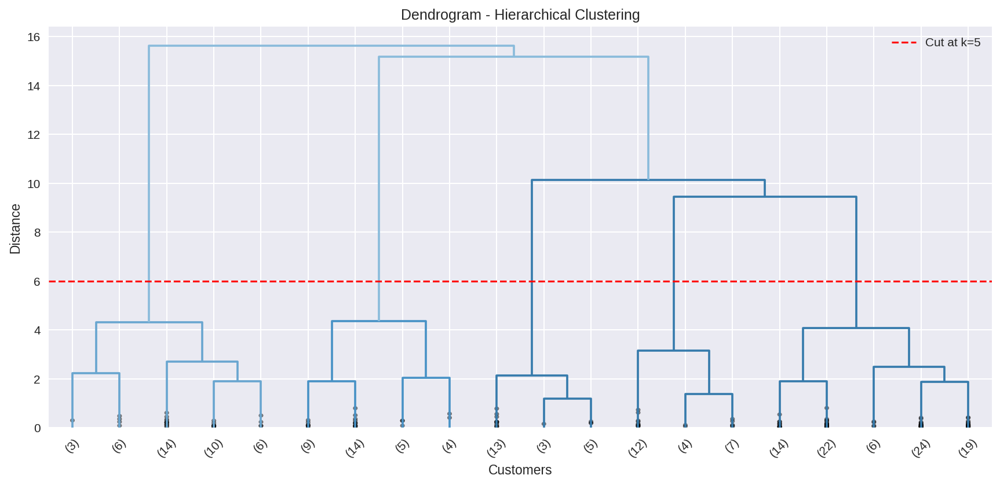
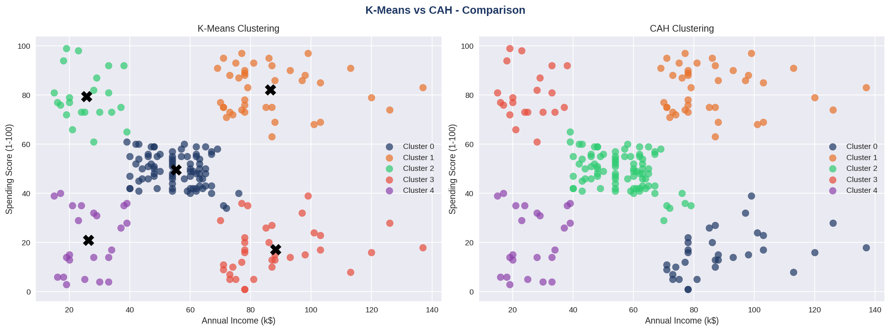
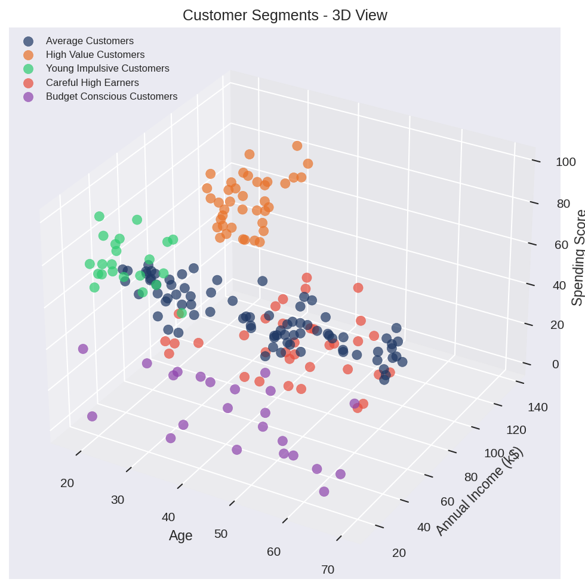

# 🛍️ Mall Customer Segmentation
Python | Pandas | Scikit-learn | Matplotlib | Seaborn

---

## 📌 Overview

200 customers. 3 variables. One question : who is actually spending, and who is not ?

This project segments mall customers into distinct groups using K-Means and CAH clustering to help the marketing team stop guessing and start targeting.

---

## 🗂️ Dataset

**Source:** [Mall Customer Segmentation - Kaggle](https://www.kaggle.com/datasets/vjchoudhary7/customer-segmentation-tutorial-in-python)

- 200 customers
- 5 variables : CustomerID, Gender, Age, Annual Income, Spending Score
- No missing values, no duplicates

---

## 🛠️ Tools and Skills

| Skill | Detail |
|---|---|
| **Data Preparation** | Normalization with StandardScaler |
| **Optimal k Selection** | Elbow Method, Silhouette Score |
| **Clustering** | K-Means, CAH (Agglomerative) |
| **Validation** | Cross-algorithm comparison |
| **Visualization** | 2D clusters, 3D view, Dendrogram |

---

## 📊 Analysis Structure

### 🔍 Exploratory Data Analysis
- Age, Income and Spending Score distributions
- Bivariate scatter plots
- Gender analysis with boxplots

### 🔢 Finding the Optimal k
- Elbow Method: inflection point at k=5
- Silhouette Score:  peak confirmed at k=5

### 🎯 K-Means Clustering
- Training with k=5
- 2D visualization with centroids
- Cluster profiling and business naming

### 🌳 Hierarchical Clustering (CAH)
- Ward linkage dendrogram
- CAH training with k=5
- Cross-validation against K-Means results

### 🌐 3D Visualization
- Age, Income and Spending Score in a single 3D view

---

## 🔍 The 5 Customer Segments

| Segment | Count | Avg Income | Avg Score |
|---|---|---|---|
| Average Customers | 81 | $55K | 49 |
| High Value Customers | 39 | $86K | 82 |
| Young Impulsive Customers | 22 | $25K | 79 |
| Careful High Earners | 35 | $88K | 17 |
| Budget Conscious Customers | 23 | $26K | 21 |

---

## 💡 What the Data Actually Says

### ⭐ High Value Customers
Young professionals earning $86K and spending freely. 
Score of 82 out of 100. The most profitable segment - worth every retention effort the business can make.

### 💰 Careful High Earners
The most interesting finding. $88K average income but a spending score of just 17.
The money is there. The conversion is not.
This is the single biggest growth opportunity in the dataset.

### 🛍️ Young Impulsive Customers
$25K income, spending score of 79.
High engagement despite modest means.
The gap between income and spending is worth watching closely.

### 👥 Average Customers
The largest group at 81 customers.
Stable but disengaged. A well-timed promotion could move a meaningful portion of this segment upward.

### 💵 Budget Conscious Customers
Low income, low spending.
Entry-level ranges and value deals are the most realistic approach.

---

## ✅ Algorithm Validation

Both K-Means and CAH identify the same 5 segments with nearly identical profiles.
This convergence across two independent algorithms validates the cluster structure and makes the segmentation reliable enough to support business decisions.

---

## 💡 Three Things Worth Doing

| Priority | Action |
|---|---|
| 1 | Build a loyalty program for High Value Customers |
| 2 | Design exclusive offers targeting Careful High Earners |
| 3 | Create installment options for Young Impulsive Customers |

---

## 📊 Visualizations

### Elbow Method

### Silhouette Score

### Customer Segments

### Cluster Profiles

### Dendrogram

### K-Means vs CAH

### 3D View

---

## 📁 Repository Structure

''' Mall-Customer-Segmentation/
├── README.md
├── Mall_Customer_Segmentation.ipynb
└── assets/
├── elbow_method.png
├── silhouette_score.png
├── clusters_visualization.png
├── cluster_profiles.png
├── dendrogram.png
├── kmeans_vs_cah.png
└── clusters_3d.png '''
